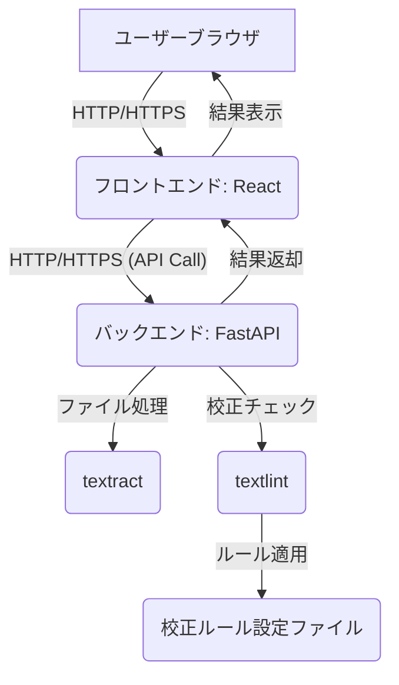

# ドキュメント事前チェックツール

## 概要

Word、Excel、PDF、PowerPointなどのドキュメントの校正チェックを自動で行うWebアプリケーションです。  
誤字脱字、表記ゆれ、日本語文法の問題などを事前に検出し、ドキュメント品質の向上とレビュー効率化を支援します。

## 主な機能

- **多形式対応**: Word、Excel、PDF、PowerPoint ファイルに対応
- **日本語校正**: 助詞の重複、表記ゆれ、冗長表現などを検出
- **直感的UI**: ドラッグ&ドロップでファイルアップロード
- **詳細レポート**: 問題箇所の詳細情報と修正提案
- **バッチ処理**: 複数ファイルの一括チェック

## システム構成

```
proofing/
├── frontend/           # React + TypeScript フロントエンド
│   └── app/
├── backend/            # FastAPI バックエンド
│   └── app/
└── docker-compose.yml  # Docker構成
```

## クイックスタート

### 前提条件

- Docker & Docker Compose
- または、Python 3.12+ と Node.js 18+

### Docker を使用した起動

```bash
# プロジェクトルートで
docker-compose up --build
```

- フロントエンド: http://localhost:3000
- バックエンドAPI: http://localhost:8000

### 手動でのセットアップ

#### バックエンド

```bash
cd backend
uv sync
uv run python run_dev.py
```

#### フロントエンド

```bash
cd frontend/app
npm install
npm run dev
```

## 使用方法

1. ブラウザで http://localhost:3000 にアクセス
2. 対応形式のファイルをドラッグ&ドロップまたは選択
3. 自動で解析開始
4. 結果を確認し、必要に応じてダウンロード

## 対応ファイル形式

| 形式 | 拡張子 | 説明 |
|------|--------|------|
| Word | .docx, .doc | Microsoft Word ドキュメント |
| Excel | .xlsx, .xls | Microsoft Excel スプレッドシート |
| PowerPoint | .pptx, .ppt | Microsoft PowerPoint プレゼンテーション |
| PDF | .pdf | Adobe PDF ドキュメント |

## 校正チェック項目

- **二重助詞**: 「が」「を」「に」などの助詞の重複
- **ゼロ幅スペース**: 見えない文字の検出
- **表記ゆれ**: 同一語句の異なる表記
- **冗長表現**: 不要な重複表現
- **文体混在**: 敬語と常体の混在
- **長文検出**: 読みにくい長い文章

## API エンドポイント

| メソッド | エンドポイント | 説明 |
|----------|---------------|------|
| GET | `/` | ヘルスチェック |
| GET | `/health` | 詳細なヘルスチェック |
| GET | `/config` | アプリケーション設定 |
| POST | `/check` | ドキュメントの校正チェック |

## 開発

### バックエンド開発

詳細は [backend/README.md](backend/README.md) を参照

```bash
cd backend
uv sync                    # 依存関係インストール
uv run python run_dev.py   # 開発サーバー起動
uv run python test_api.py  # APIテスト実行
```

### フロントエンド開発

詳細は [frontend/README.md](frontend/README.md) を参照

```bash
cd frontend/app
npm install       # 依存関係インストール
npm run dev       # 開発サーバー起動
npm run build     # 本番ビルド
npm run lint      # ESLint実行
```

## 設定

### 環境変数

#### バックエンド

- `MAX_FILE_SIZE`: 最大ファイルサイズ（デフォルト: 50MB）
- `MAX_FILES_COUNT`: 最大ファイル数（デフォルト: 10）
- `LOG_LEVEL`: ログレベル（デフォルト: INFO）
- `CORS_ORIGINS`: CORS許可オリジン（デフォルト: *）

#### フロントエンド

- `VITE_API_BASE_URL`: バックエンドAPI URL（デフォルト: http://localhost:8000）

## トラブルシューティング

### よくある問題

1. **バックエンド接続エラー**
   - バックエンドサーバーが起動していることを確認
   - ポート8000が使用可能か確認

2. **ファイルアップロードエラー**
   - ファイルサイズ制限を確認
   - 対応形式かどうか確認

3. **Dockerエラー**
   - Docker Composeが最新版か確認
   - `docker-compose down && docker-compose up --build`

### ログの確認

```bash
# バックエンドログ
docker-compose logs backend

# フロントエンドログ
docker-compose logs frontend
```

## ライセンス

このプロジェクトは MIT ライセンスの下で公開されています。

## 貢献

1. このリポジトリをフォーク
2. フィーチャーブランチを作成 (`git checkout -b feature/amazing-feature`)
3. 変更をコミット (`git commit -m 'Add amazing feature'`)
4. ブランチにプッシュ (`git push origin feature/amazing-feature`)
5. プルリクエストを作成

## 技術スタック

### バックエンド

- **FastAPI**: Python Webフレームワーク
- **textract**: ドキュメントテキスト抽出
- **プラグイン型校正エンジン**: 拡張可能な校正ルール
- **uvicorn**: ASGI サーバー

### フロントエンド

- **React 19**: UIライブラリ
- **TypeScript**: 型安全性
- **Vite**: 高速ビルドツール
- **Axios**: HTTPクライアント
- **React Dropzone**: ファイルアップロード

### インフラ

- **Docker**: コンテナ化
- **Docker Compose**: オーケストレーション
      * 解析完了後、Webブラウザ上でチェック結果をリアルタイムまたは準リアルタイムで表示できること。
      * ファイルごと、またはアップロードした全ファイルの結果を一覧で確認できること。
      * 問題箇所を特定しやすいように、元のドキュメント（またはその抜粋）と対応付けて表示できると望ましい。
  * **結果ダウンロード:**
      * チェック結果を、後から参照できるようファイル形式（例：CSV, JSON, HTMLレポートなど）でダウンロードできること。

### 4.4. 履歴管理機能 (将来的な要件)

  * アップロードされたドキュメントとチェック結果の履歴を管理できること。
  * 過去のチェック結果を参照できること。

### 4.5. バージョン管理システム連携機能 (将来的な要件)

  * SVNまたはGitリポジトリのURLを指定し、リポジトリ内のドキュメントを直接チェックできること。
  * 特定のブランチやコミット、パスを指定してチェックできること。
  * 差分チェック機能（変更された箇所のみを対象とする）を実現できると望ましい。

## 5. 非機能要件

### 5.1. パフォーマンス

  * 大量のドキュメント（例：〇MB、〇ファイル）をアップロードした場合でも、許容できる時間内に解析が完了すること。
  * 同時アクセスユーザー数（例：〇名）を想定し、安定したレスポンスを提供できること。

### 5.2. セキュリティ

  * アップロードされたドキュメントは安全に処理・保管されること（一時的な保管、処理後の削除など）。
  * ユーザー認証・認可機能（将来的な要件）を実装する場合、適切なセキュリティ対策を講じること。
  * CORSなどのセキュリティ設定を適切に行うこと。

### 5.3. 信頼性

  * システム障害発生時にも、可能な限りデータが保護されること。
  * エラーハンドリングが適切に行われ、ユーザーにわかりやすいエラーメッセージが提示されること。

### 5.4. 拡張性

  * 新しいドキュメント形式や校正ルールの追加が容易であること。
  * ユーザー数の増加や機能拡張に対応できるアーキテクチャであること。

### 5.5. 運用性

  * システムのデプロイ、監視、ログ管理が容易であること。
  * DockerおよびKubernetes環境でのデプロイが前提であること。

### 5.6. ユーザビリティ

  * 直感的で分かりやすいUI/UXを提供すること。
  * 解析結果が明確で、ユーザーが修正アクションを取りやすいこと。

-----

# ドキュメント事前チェックツール：仕様書

## 1. システム構成

### 1.1. 全体アーキテクチャ

本システムは、ユーザーインターフェースを提供する**フロントエンド**と、ドキュメント処理および校正チェックを実行する**バックエンド**の2つの主要コンポーネントで構成されます。これらのコンポーネントは、RESTful APIを介して通信します。デプロイはDockerコンテナをベースとし、最終的にはKubernetes環境での運用を想定します。



### 1.2. バックエンド

  * **技術スタック:** Python, FastAPI

  * **主要ライブラリ:**

      * `textract`: ドキュメントからのテキスト抽出
      * `textlint` (またはそのPythonラッパー): テキスト校正
      * `uvicorn`: ASGIサーバー（FastAPIの実行）
      * `python-multipart`: ファイルアップロード処理
      * `pydantic`: データバリデーション

  * **APIエンドポイント (案):**

    | エンドポイント | メソッド | 説明 | リクエストボディ | レスポンス |
    | :------------- | :------- | :--- | :--------------- | :--------- |
    | `/check` | `POST` | ドキュメントをアップロードし、チェックを実行 | `multipart/form-data` (ファイルデータ) | `JSON` (チェック結果) |
    | `/status/{task_id}` | `GET` | (非同期処理の場合) チェックタスクの進捗状況を取得 | なし | `JSON` (ステータス) |
    | `/results/{task_id}` | `GET` | (非同期処理の場合) チェック結果を取得 | なし | `JSON` (チェック結果) |

  * **処理フロー:**

    1.  フロントエンドからドキュメントファイルを受信する。
    2.  受信したファイルを一時的に保存する。
    3.  `textract`を用いて、各ドキュメントからテキストを抽出する。
    4.  抽出したテキストを`textlint`に渡し、事前に設定された校正ルールに基づいてチェックを実行する。
    5.  `textlint`からの結果（問題箇所、種類、位置情報など）をパースする。
    6.  パースした結果をJSON形式で整形し、フロントエンドに返却する。
    7.  処理後、一時保存したファイルを削除する。

### 1.3. フロントエンド

  * **技術スタック:** React (TypeScript推奨), HTML, CSS
  * **主要ライブラリ/フレームワーク:**
      * `React Router`: ルーティング
      * `Axios`: バックエンドAPIとの通信
      * UIコンポーネントライブラリ (例: Material-UI, Ant Designなど、検討中)
  * **主要画面 (案):**
      * **ファイルアップロード画面:**
          * ドラッグ＆ドロップまたはファイル選択ダイアログによるファイル/ディレクトリ選択UI。
          * アップロードファイルのリスト表示（ファイル名、サイズなど）。
          * アップロード開始ボタン。
      * **チェック結果表示画面:**
          * 解析中のローディング表示。
          * 解析結果のサマリー表示（問題数、ファイル数など）。
          * 各ファイルのチェック結果詳細表示（ファイル名、問題箇所、エラー内容、修正提案など）。
          * 問題箇所をハイライト表示する機能（可能であれば）。
          * 結果ダウンロードボタン。
  * **処理フロー:**
    1.  ユーザーがファイル/ディレクトリを選択し、アップロードボタンをクリックする。
    2.  選択されたファイルを`FormData`オブジェクトに格納し、バックエンドの`/check`エンドポイントへHTTP POSTリクエストを送信する。
    3.  バックエンドからのレスポンス（チェック結果）を受信する。
    4.  受信した結果を解析し、UIに表示する。
    5.  ユーザーが結果をダウンロードできるように、適切なフォーマットでデータを提供する。

## 2. 校正ルール

  * **textlintの利用:**
      * textlintのルールを組み合わせて使用します。
      * プロジェクト固有のルールは、カスタムtextlintルールとして実装するか、既存ルールの設定で対応します。
  * **初期導入ルール (例):**
      * `textlint-rule-no-mix-dearu-desumasu`: 「ですます調」と「である調」の混在禁止
      * `textlint-rule-no-doubled-joshi`: 二重助詞の検出
      * `textlint-rule-no-zero-width-spaces`: ゼロ幅スペースの検出
      * `textlint-rule-preset-ja-technical-writing`: 技術文書向けのルールセット
      * `textlint-rule-preset-ja-spacing`: 日本語のスペースに関するルールセット
      * `textlint-rule-ja-no-successive-word`: 同一語句の連続使用の検出
      * `textlint-rule-ja-no-redundant-expression`: 重複表現の検出
  * **ルール設定:**
      * バックエンド側に`.textlintrc`などの設定ファイルを配置し、ルールを管理します。
      * 必要に応じて、API経由でルール設定を動的に変更できる機能を検討します（将来的な拡張）。

## 3. 開発・デプロイ環境

### 3.1. 開発環境

  * **Docker Compose:** ローカル開発環境を構築するため、バックエンドとフロントエンドを分離したDocker Composeファイルを作成します。
  * **ホットリロード:** 開発効率を上げるため、ソースコード変更時に自動でアプリケーションが再起動する仕組みを導入します（FastAPI, Reactそれぞれで）。

### 3.2. デプロイ環境

  * **Dockerイメージ:** バックエンド、フロントエンドそれぞれを個別のDockerイメージとしてビルドします。
  * **Kubernetes:**
      * 各コンポーネントをPodとしてデプロイします。
      * Service, Deployment, IngressなどのKubernetesリソースを定義します。
      * Persistent Volume (PV) / Persistent Volume Claim (PVC) の必要性を検討します（一時ファイル保存や将来的な履歴管理のため）。
      * Horizontal Pod Autoscaler (HPA) による自動スケーリングを検討します。
  * **CI/CD:** Gitリポジトリへのプッシュをトリガーに、自動テスト、Dockerイメージビルド、Kubernetesへのデプロイを行うCI/CDパイプラインを構築します。

## 4. 今後のロードマップ (優先度順)

1.  **バックエンドのMVP (Minimum Viable Product) 開発:**
      * FastAPIによるAPI定義とファイルアップロード機能。
      * `textract`によるテキスト抽出。
      * `textlint`による基本的な校正チェックと結果のJSON返却。
      * Dockerizedされたバックエンド。
2.  **フロントエンドのMVP開発:**
      * ReactによるファイルアップロードUI。
      * バックエンドAPIとの連携と結果表示UI。
      * Dockerizedされたフロントエンド。
3.  **複数ファイル/ディレクトリ対応:**
      * バックエンドでの複数ファイル同時処理ロジックの実装。
      * フロントエンドでの複数ファイル/ディレクトリ選択UI。
4.  **非同期処理の導入:**
      * 大容量ファイルや多数のファイルアップロード時に、バックエンドでの非同期処理（例: Celery + Redis）を導入し、ユーザーへの即時応答と処理状況表示を実現。
5.  **校正ルール管理機能の強化:**
      * 管理画面からのルール追加・編集機能。
      * プロジェクト固有の辞書登録機能。
6.  **バージョン管理システム連携:**
      * SVN/Gitリポジトリからの直接チェック機能。
      * 差分チェック機能。
7.  **認証・認可機能:**
      * ユーザー管理とアクセス制御。
8.  **履歴管理機能:**
      * チェック履歴の保存と参照。